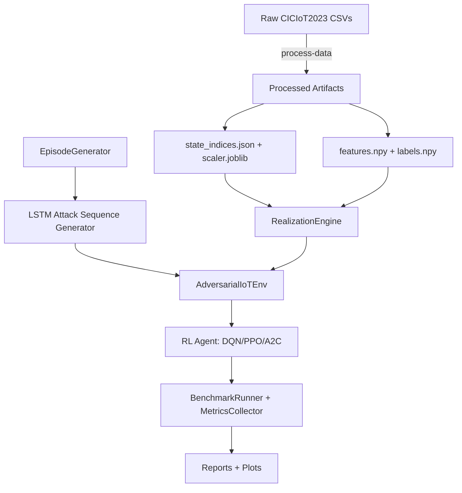

# Architecture Overview

## System summary

The system implements an **adversarial training loop** over real CICIoT2023 traffic. The Red Team produces sequences of abstract attack stages; the Blue Team observes realized traffic samples and learns a defensive policy via RL.

### Key subsystems

- **Dataset Processor** (`src/utils/dataset_processor.py`)
  - Creates `features.npy`, `labels.npy`, `state_indices.json`, `scaler.joblib`, `metadata.json`.
- **Attack Sequence Generator (LSTM)** (`src/generator/attack_sequence_generator.py`)
  - Next-token model over Kill Chain stages.
- **Episode Generator** (`src/generator/episode_generator.py`)
  - Synthesizes sequences using Kill Chain grammar and optional stage distributions.
- **Adversarial Environment** (`src/environment/adversarial_env.py`)
  - Gymnasium env with hidden attack stage and feature-window observations.
- **RL Algorithms** (`src/algorithms/adversarial_algorithm.py`)
  - Stable Baselines3 wrappers for DQN/PPO/A2C.
- **Training Manager** (`src/training/training_manager.py`)
  - MLflow tracking, callbacks, and artifact management.
- **Benchmarking** (`src/benchmarking/*`)
  - Evaluation metrics and analysis plots.

## End-to-end flow

## Execution modes (main entrypoint)

`main.py` orchestrates the pipeline via `--mode`:

- `process-data` → prepares CICIoT2023 for environment.
- `train-generator` → trains LSTM on synthetic episodes.
- `train-rl` → trains one RL policy.
- `train-all-rl` → trains DQN, PPO, A2C.
- `train-all` → full pipeline.
- `evaluate` → single-model or multi-model benchmark.

## Core abstractions

### Abstract state (Kill Chain)

Kill Chain has 5 stages mapped from CICIoT2023 labels:

$$\text{stage} \in \{0:\text{BENIGN},1:\text{RECON},2:\text{ACCESS},3:\text{MANEUVER},4:\text{IMPACT}\}$$

### Hidden state & observation

The environment’s true stage is **hidden**. The agent observes only **realized features** sampled from stage-specific data pools:

- Observation = flattened window of $k$ samples
- Optionally concatenates deltas between consecutive samples

### Action space (Force Continuum)

$$\mathcal{A} = \{0:\text{OBSERVE},1:\text{LOG},2:\text{THROTTLE},3:\text{BLOCK},4:\text{ISOLATE}\}$$

Actions carry explicit costs and influence the reward.

## Why this architecture

- **Real data only:** Observations are derived from actual CICIoT2023 rows (no synthetic traffic).
- **Attack grammar:** LSTM learns progression rules rather than memorizing raw labels.
- **Partial observability:** Forces RL to infer threat state from features, not stage labels.
- **Benchmarking focus:** Dedicated evaluation layer for security metrics, not just reward.
